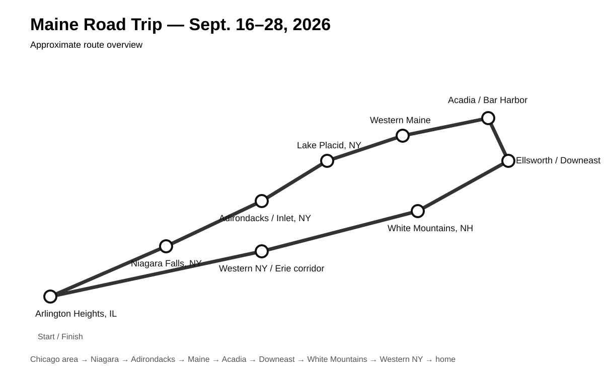

# Maine Road Trip — Master Checklist

Trip: Sept. 16–28, 2026

Use this as the living packing and prep list. Add items whenever they come to mind and check them off as they are packed or completed.

## Buy / Decide
- [ ] Decide whether to keep the 10x10 canopy
- [ ] Confirm exact campgrounds and hotels
- [ ] Confirm Cadillac Mountain reservation plan
- [ ] Confirm Maine ATV registration / trail requirements
- [ ] Confirm XR400 street-legal / registration plan

## Silverado / Recovery
- [ ] Check oil, coolant, brake fluid
- [ ] Check all four tires and spare
- [ ] Full-size spare tire
- [ ] Tire pressure gauge
- [ ] Air compressor
- [ ] Tire plug kit
- [ ] Jack and lug tools
- [ ] Jumper pack
- [ ] Recovery strap
- [ ] Soft shackles
- [ ] Shovel
- [ ] Work gloves
- [ ] Basic hand tools
- [ ] Headlamp
- [ ] Flashlight
- [ ] Spare fluids as needed

## XR400
- [ ] Helmet
- [ ] Boots
- [ ] Gloves
- [ ] Riding gear
- [ ] Oil / filter service complete
- [ ] Air filter checked
- [ ] Chain adjusted and lubricated
- [ ] Tires checked
- [ ] Brakes checked
- [ ] Spare spark plug
- [ ] Tire irons
- [ ] Tube / tire repair solution
- [ ] Compact pump
- [ ] Spare master link
- [ ] Trail-side tool kit
- [ ] Fuel plan / extra fuel if needed
- [ ] Lock / chain
- [ ] Title / registration / insurance paperwork

## Bicycles
- [ ] Helmets
- [ ] Locks
- [ ] Flat repair kits
- [ ] Bike pump
- [ ] Lights
- [ ] Rack straps / security
- [ ] Tires checked
- [ ] Brakes checked
- [ ] Chains lubricated

## Camping
- [ ] Napier truck-bed tent
- [ ] Mattress / sleeping pad
- [ ] Pump
- [ ] Sleeping bags / blankets
- [ ] Pillows
- [ ] Camp chairs
- [ ] Stove
- [ ] Stove fuel
- [ ] Lighter / backup ignition
- [ ] Cookware
- [ ] Utensils
- [ ] Cooler
- [ ] Water containers
- [ ] Food / road snacks
- [ ] Trash bags
- [ ] Towels
- [ ] Toiletries
- [ ] Headlamps
- [ ] Canopy or tarp / rain shelter
- [ ] Stakes and guylines

## Clothing / Personal
- [ ] Rain jacket
- [ ] Warm layers
- [ ] Hiking shoes / boots
- [ ] Casual shoes
- [ ] Socks / underwear
- [ ] Toiletries
- [ ] Medications
- [ ] Sunscreen
- [ ] Bug spray
- [ ] First-aid kit
- [ ] IDs
- [ ] Credit / debit cards
- [ ] Some cash

## Navigation / Electronics
- [ ] Offline maps — Niagara
- [ ] Offline maps — Adirondacks
- [ ] Offline maps — Acadia
- [ ] Offline maps — Downeast Maine
- [ ] Offline maps — White Mountains
- [ ] Phone chargers
- [ ] Vehicle chargers
- [ ] Power bank
- [ ] Phone mount
- [ ] Flashlights charged
- [ ] Jump pack charged
- [ ] Paper backup map

## Reservations / Documents
- [ ] Niagara lodging confirmation
- [ ] Adirondacks campground / lodging
- [ ] Acadia campground / lodging
- [ ] Bar Harbor hotel
- [ ] Maine riding-area campground
- [ ] White Mountains lodging
- [ ] Western NY return-night lodging
- [ ] Cadillac Mountain reservation
- [ ] Acadia entrance pass / requirements
- [ ] Maine ATV registration
- [ ] Roadside-assistance info
- [ ] Auto insurance info
- [ ] XR400 paperwork
- [ ] Reservation confirmation numbers saved offline

## Before Departure
- [ ] Full-load Silverado + XR400 shakedown drive
- [ ] Recheck all tie-downs after shakedown
- [ ] Confirm bike rack security
- [ ] Check weather along route
- [ ] Check Moose River Plains access / closures
- [ ] Check Maine ATV trail closures
- [ ] Check Acadia alerts / road closures
- [ ] Fill Silverado fuel tank
- [ ] Load cooler
- [ ] Fill water
- [ ] Charge everything
- [ ] Download all offline maps
- [ ] Share itinerary / emergency info

## Add-on / Brain Dump
- [ ]
